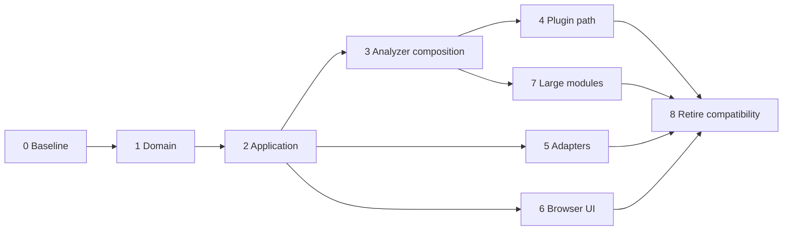

# Source Architecture Refactor

> Engineering contract: [`../AGENTS.md`](../AGENTS.md)

Status: 📌 Next

---

## Objective

Refactor the whole source tree into clearer domain/application/adapters
boundaries while preserving existing behavior for the browser demo, local CLI,
GitHub PR review, deterministic analyzers, React intelligence, AI review, plugin
runtime, and quality gates.

This is a structural refactor, not a rewrite. The repository remains a
TypeScript/Vite/React project and keeps the current analyzer-first review model.

---

## Current Execution Paths

### Browser demo path

```text
src/main.tsx
  -> src/App.tsx
  -> src/components/ScoreCard.tsx
  -> src/components/FindingCard.tsx
```

`src/App.tsx` currently constructs a static `ReviewResult` demo object and does
not call GitHub, the analyzer pipeline, or an AI provider.

### Local CLI path

```text
scripts/ai-reviewer.ts
  -> src/cli/run.ts
  -> src/cli/args.ts
  -> src/cli/files.ts
  -> src/review/reviewer.ts reviewFiles()
  -> src/analyzer/index.ts analyzeFilesWithWarnings()
  -> src/react/engine/react-engine.ts for JSX/TSX files
  -> src/review/aggregator.ts
```

The CLI adapter already keeps process IO mostly outside the review logic, but
`src/cli/files.ts` imports `ReviewFile` from `src/review/reviewer.ts`, coupling
file collection to the high-level reviewer module.

### GitHub PR review path

```text
scripts/review-pr.ts
  -> src/github/client.ts
  -> src/github/diff.ts
  -> src/review/reviewer.ts reviewPullRequest()
  -> src/analyzer/index.ts
  -> src/react/engine/react-engine.ts
  -> src/ai/input-policy.ts
  -> src/engine/review-engine.ts
  -> src/analyzer/security/quality-gate
  -> src/github/check-run.ts + src/github/comments.ts
```

`reviewPullRequest()` is the current application orchestrator. It performs
parseability checks, deterministic analyzer selection, React plugin selection,
AI input preparation, review-engine execution, and security quality gate
application in one module.

### Plugin analysis path

```text
src/plugins/runtime.ts
  -> src/analyzer/index.ts
  -> contributed plugin analyzers
  -> src/react/engine/react-engine.ts
```

Plugin runtime already acts like a composition layer, but it duplicates part of
the deterministic analyzer orchestration that also exists in `review/reviewer.ts`.

---

## Target Structure

```text
src/
├── domain/
│   └── review/
│       ├── finding.ts
│       ├── result.ts
│       ├── warning.ts
│       ├── scoring.ts
│       ├── decision.ts
│       ├── aggregation.ts
│       └── index.ts
├── application/
│   └── review/
│       ├── ports/
│       ├── services/
│       ├── use-cases/
│       ├── composition-root.ts
│       └── index.ts
├── analyzer/
│   ├── shared/
│   ├── ast/
│   ├── architecture/
│   ├── security/
│   └── performance/
├── react/
├── mfe/
├── ai/
│   ├── providers/
│   ├── parsing/
│   └── prompts/
├── github/
├── cli/
├── plugins/
└── ui/
```

Ownership:

- `domain/review`: pure review contracts, score/stat calculation, decisions,
  and aggregation. No imports from concrete infrastructure or analyzers.
- `application/review`: use cases and ports. Coordinates deterministic review,
  optional AI review, and quality gate policy through injected dependencies.
- `analyzer`, `react`, `mfe`: deterministic adapters that return domain review
  findings and warnings.
- `ai`: AI provider, prompt, parser, retry, input policy, and multi-agent
  provider adapter.
- `github`: Pull Request, diff, Check Run, and PR review adapter.
- `cli`: local CLI adapter and filesystem/Git source collection.
- `plugins`: extension registry/runtime wired through application ports.
- `ui`: browser presentation and composition only. The existing `App.tsx` and
  `components/` paths remain temporary compatibility/bootstrap surfaces.

The repository remains one npm package throughout R1. A workspace or monorepo
split is out of scope until multiple deliverables require independent
versioning or publication.

---

## Refactor Phases



Phases 5, 6, and 7 may run in parallel after their dependencies are complete.
Each phase owns distinct directories; shared public contracts remain owned by
the domain/application phases.

### Phase 0 — Baseline Characterization

Status: ⏳ Planned

Scope:

- Add characterization coverage for the current review API surfaces:
  `reviewFiles()`, `reviewPullRequest()`, `ReviewEngine.execute()`,
  `analyzeFilesWithWarnings()`, and `analyzeWithPlugins()`.
- Capture expected warning behavior for parse failures, AI omission/redaction,
  AI provider failure, and security quality gate decisions.
- Add a lightweight dependency-boundary check for `domain/` once it exists.

Acceptance criteria:

- Existing behavior is documented by tests before moves begin.
- `npm run typecheck`, `npm run lint`, `npm test`, and `npm run build` pass.

### Phase 1 — Extract Review Domain

Status: ⏳ Planned

Depends on: Phase 0

Scope:

- Move review model, score/stat calculation, decision, and aggregation into
  `src/domain/review/`.
- Keep compatibility re-exports from `src/review/types.ts`,
  `src/review/scorer.ts`, `src/review/aggregator.ts`, and
  `src/engine/decision.ts`.
- Remove the current dependency inversion where `review/aggregator.ts` imports
  `engine/decision.ts` while `ReviewEngine` imports `aggregateReview()`.

Acceptance criteria:

- No behavior changes in review scoring or decisions.
- Existing imports continue to compile through compatibility exports.
- Domain files have no imports from `application`, `ai`, `github`, `ui`,
  `components`, `plugins`, `cli`,
  `scripts`, or concrete analyzer modules.

### Phase 2 — Create Application Review Use Cases

Status: ⏳ Planned

Depends on: Phase 1

Scope:

- Introduce `src/application/review/ports.ts` for source files, deterministic
  analyzer, AI reviewer, quality gate evaluator, clock/timer, and publisher
  contracts.
- Move `reviewFiles()` and `reviewPullRequest()` orchestration into
  `src/application/review/` while keeping `src/review/reviewer.ts` as a facade.
- Move parseability filtering, React plugin selection, AI input preparation
  decisions, and quality gate decision composition out of the legacy reviewer
  facade.

Acceptance criteria:

- `scripts/review-pr.ts`, `src/cli/run.ts`, tests, and plugin runtime can call
  the new application use cases or old facades without behavior drift.
- Application code depends on ports and domain contracts, not concrete GitHub
  or OpenAI implementations.

### Phase 3 — Consolidate Deterministic Analyzer Composition

Status: ⏳ Planned

Depends on: Phase 2

Scope:

- Split `src/analyzer/index.ts` into smaller composition modules:
  source filtering, AST rules, security adapter, performance adapter,
  architecture graph adapter, MFE adapter, and warning aggregation.
- Provide a single deterministic review adapter used by CLI, PR review, and
  plugin runtime.
- Define one typed analyzer contribution contract and immutable registry.
- Register built-in AST, architecture, security, performance, React, MFE, and
  supply-chain analyzers through the same composition mechanism.
- Move shared parser, source-file, location, and rule contracts into
  `src/analyzer/shared/` without creating a generic utility dumping ground.
- Keep React-specific intelligence under `src/react/`; register it explicitly
  from application composition rather than hidden duplication.

Acceptance criteria:

- Deterministic findings remain produced before AI findings.
- `analyzer/` still does not call LLMs or GitHub APIs.
- Plugin runtime and core review pipeline share the same deterministic
  composition path where possible.
- Built-in analyzer ordering is explicit and covered by tests.
- Adding an analyzer does not require changing application use cases.

### Phase 4 — Make Plugins the Single Extension Path

Status: ⏳ Planned

Depends on: Phase 3

Scope:

- Align plugin contracts with the application ports and analyzer registry.
- Route analyzer, AST rule, React rule, AI provider, and output adapter
  contributions through the main composition root.
- Define deterministic contribution ordering, ID collision, and failure
  isolation policies.
- Remove the parallel composition behavior from `src/plugins/runtime.ts` after
  all consumers use the shared application pipeline.

Acceptance criteria:

- CLI and PR review execute plugin contributions through the same pipeline.
- Core behavior is identical when no external plugins are configured.
- Duplicate contribution IDs fail before analysis begins.
- A failing plugin cannot silently discard successful core findings.
- Contract tests cover every contribution type supported by the runtime.

### Phase 5 — Adapter Boundary Cleanup

Status: ⏳ Planned

Depends on: Phase 2 and Phase 4 for plugin-aware entry points

Scope:

- Keep `scripts/ai-reviewer.ts` and `scripts/review-pr.ts` as thin process
  adapters only.
- Move PR review assembly into a GitHub/application adapter that converts GitHub
  PR files into application source-file contracts.
- Move filesystem/Git collection types in `src/cli/files.ts` away from
  `src/review/reviewer.ts` and toward application ports.
- Ensure `ai/factory.ts` remains provider construction only; no GitHub or domain
  orchestration should move into `ai/`.

Acceptance criteria:

- Process scripts contain only environment parsing, adapter construction, and
  exit-code/console behavior.
- GitHub-specific code stays inside `github/` or an explicit GitHub adapter.
- CLI source collection no longer depends on the legacy reviewer module.

### Phase 6 — Browser Composition and Fixture Separation

Status: ⏳ Planned

Depends on: Phase 2

Scope:

- Move static demo data out of `src/App.tsx` into `src/ui/fixtures/` or a
  dedicated demo module.
- Move presentation by feature under `src/ui/`; retain a minimal Vite bootstrap
  and temporary compatibility exports for existing components.
- If the browser later connects to real reviews, add an application adapter
  rather than calling GitHub, analyzers, or AI providers directly from
  components.

Acceptance criteria:

- `App` composes UI state; it does not own review-domain sample construction.
- Components continue to have no GitHub, AST, LLM, or scoring logic.
- Existing E2E dashboard behavior remains stable.

### Phase 7 — Decompose Oversized Analyzer Modules

Status: ⏳ Planned

Depends on: Phase 3

Scope:

- Prioritize production modules above 800 lines, including browser security
  modeling, React reference/scope analysis, taint analysis, and injection
  modeling.
- Split by semantic stage: collection, classification, graph/flow building,
  sanitization, matching, evidence construction, and orchestration.
- Preserve subsystem-local models and public entry points.
- Extract a shared helper only when repeated semantic behavior is demonstrated
  in at least two rule families.

Acceptance criteria:

- No production TypeScript source file exceeds 800 lines.
- Rule IDs, locations, evidence, confidence, severity, and finding order remain
  stable unless an independently approved behavior plan says otherwise.
- Extracted stages have focused unit tests.
- Baseline analysis timing shows no material regression, or an accepted
  regression is documented with evidence.

### Phase 8 — Compatibility Retirement and Boundary Hardening

Status: ⏳ Planned

Depends on: Phases 4–7

Scope:

- Once all internal imports use the new structure, remove legacy facades only
  if they are not part of the intended public API.
- Update docs, architecture diagrams, and plan statuses.
- Add or update import-boundary tests to keep the new structure from drifting.
- Remove dead orchestration and placeholder contracts only after repository-wide
  import and behavior audits prove they are obsolete.
- Enforce architecture dependency tests in CI.

Acceptance criteria:

- No stale imports depend on old compatibility paths unless intentionally
  documented.
- Documentation reflects actual source layout and current execution paths.
- Full validation passes.

---

## Compatibility Strategy

- Prefer move-plus-re-export over direct mass import rewrites.
- Keep public function names stable during migration:
  `reviewFiles()`, `reviewPullRequest()`, `aggregateReview()`, and
  `ReviewEngine.execute()`.
- Move one responsibility at a time, then run validation before the next phase.
- Do not change dependencies, runtime, UI library, build tool, or AI provider
  contract as part of this refactor.

---

## Risks

- Large import churn could hide behavior regressions; mitigate with Phase 0
  characterization tests and small phases.
- Security and performance analyzers already contain many rule families; avoid
  moving rules while changing orchestration in the same step.
- `reviewPullRequest()` currently contains security gate policy composition;
  moving it must preserve baseline/suppression behavior exactly.
- Plugin runtime duplicates analyzer composition; consolidation must preserve
  contributed rule ordering and warning propagation.

---

## Validation

Run after every phase:

```bash
npm run typecheck
npm run lint
npm test
npm run build
```

For high-risk phases, also run:

```bash
npm run test:coverage
npm run test:e2e
npm run security:secrets
git diff --check
```

Networked GitHub and AI operations must remain mocked during normal validation.

---

## Definition of Done

R1 is complete only when:

- Domain and application boundaries are explicit and acyclic.
- CLI, GitHub automation, plugins, and tests share one review pipeline.
- Built-in and plugin analyzers use one typed composition mechanism.
- AI and GitHub implementations remain replaceable adapters behind ports.
- Browser and Node runtime imports are separated and enforced.
- No production TypeScript file exceeds 800 lines.
- Legacy compatibility paths are removed or have an approved owner and removal
  deadline.
- Architecture checks and behavioral regression fixtures run in CI.
- Documentation matches the implemented source tree.
- Typecheck, lint, unit/integration tests, coverage, E2E, build, and secret scan
  all pass.
